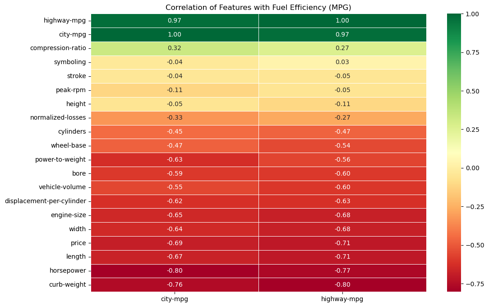
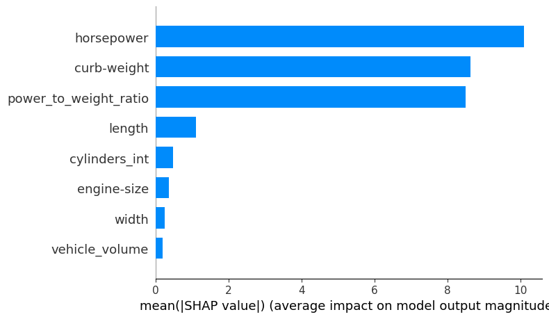

# Fuel Efficiency Prediction

This repository contains a complete Data Science pipeline designed to predict vehicle fuel efficiency (`highway-mpg`) using the **UCI Automobile Dataset**. The project focuses on **Feature Engineering** and **Model Interpretability (XAI)** to provide actionable insights for automotive R&D.

## Tech Stack
* **Language:** Python 3.12
* **Libraries:** Pandas, NumPy, Scikit-Learn, SHAP, Matplotlib, Seaborn.
* **Tools:** Git, Jupyter Notebooks, Power BI (Simulation Dashboard).

---

## Project Methodology

### Phase 1: Data Cleaning & Ingestion
The dataset was preprocessed to handle missing values and inconsistent types.
* **Imputation Strategy:** `normalized-losses` were imputed using the mean by car `make` to preserve data integrity.
* **Quality Control:** Rows with missing critical mechanical data (`horsepower`, `price`) were removed to ensure model reliability.

### Phase 2: Feature Engineering
We derived new metrics based on automotive physics to capture non-linear relationships:
* **Power-to-Weight Ratio:** `horsepower / curb-weight`.
* **Vehicle Volume:** `length * width * height`.
* **Displacement per Cylinder:** `engine-size / cylinders`.

> **Key Discovery:** The correlation analysis confirmed that **Curb Weight** and **Horsepower** are the strongest detractors of efficiency.

 
### Phase 3: Model Selection
We compared four different algorithms using **5-Fold Cross-Validation** to ensure robustness given the small dataset size (~200 samples).

<style type="text/css">
#T_d523e_row0_col1, #T_d523e_row0_col3 {
  background-color: lightgreen;
}
</style>
<table id="T_d523e">
  <thead>
    <tr>
      <th class="blank level0" >&nbsp;</th>
      <th id="T_d523e_level0_col0" class="col_heading level0 col0" >Model</th>
      <th id="T_d523e_level0_col1" class="col_heading level0 col1" >Mean R2</th>
      <th id="T_d523e_level0_col2" class="col_heading level0 col2" >Std Dev R2</th>
      <th id="T_d523e_level0_col3" class="col_heading level0 col3" >Mean MAE (MPG)</th>
    </tr>
  </thead>
  <tbody>
    <tr>
      <th id="T_d523e_level0_row0" class="row_heading level0 row0" >2</th>
      <td id="T_d523e_row0_col0" class="data row0 col0" >Random Forest</td>
      <td id="T_d523e_row0_col1" class="data row0 col1" >0.820088</td>
      <td id="T_d523e_row0_col2" class="data row0 col2" >0.045126</td>
      <td id="T_d523e_row0_col3" class="data row0 col3" >1.680741</td>
    </tr>
    <tr>
      <th id="T_d523e_level0_row1" class="row_heading level0 row1" >0</th>
      <td id="T_d523e_row1_col0" class="data row1 col0" >Linear Regression</td>
      <td id="T_d523e_row1_col1" class="data row1 col1" >0.721730</td>
      <td id="T_d523e_row1_col2" class="data row1 col2" >0.047369</td>
      <td id="T_d523e_row1_col3" class="data row1 col3" >2.339970</td>
    </tr>
    <tr>
      <th id="T_d523e_level0_row2" class="row_heading level0 row2" >1</th>
      <td id="T_d523e_row2_col0" class="data row2 col0" >Ridge Regression (L2)</td>
      <td id="T_d523e_row2_col1" class="data row2 col1" >0.705864</td>
      <td id="T_d523e_row2_col2" class="data row2 col2" >0.052559</td>
      <td id="T_d523e_row2_col3" class="data row2 col3" >2.320734</td>
    </tr>
    <tr>
      <th id="T_d523e_level0_row3" class="row_heading level0 row3" >3</th>
      <td id="T_d523e_row3_col0" class="data row3 col0" >SVR (RBF Kernel)</td>
      <td id="T_d523e_row3_col1" class="data row3 col1" >0.662352</td>
      <td id="T_d523e_row3_col2" class="data row3 col2" >0.027146</td>
      <td id="T_d523e_row3_col3" class="data row3 col3" >2.545644</td>
    </tr>
  </tbody>
</table>

*The Random Forest Regressor was selected as the final model due to its ability to capture complex non-linear interactions.*

### Phase 4: Model Interpretability (SHAP)
Using SHAP values, we audited the model to verify physical consistency.
* **Non-linear interactions:** We discovered that weight reduction is significantly more critical for smaller engine segments to achieve emission compliance.
* **Transparency:** The model is no longer a "black box"; every prediction can be explained by specific technical features.



##  Engineering Insights for OEMs
1. **Weight over Displacement:** Reducing `curb-weight` by 10% has a higher impact on highway efficiency than optimizing `engine-size` by the same margin.
2. **Feature Interaction:** The relationship between power and weight is the most stable predictor across all vehicle segments.

---

## How to Run
1. **Clone the repository:** 
```bash 
git clone [https://github.com/AlfredoVazquezML/fuel-efficiency-prediction.git]
(https://github.com/AlfredoVazquezML/fuel-efficiency-prediction.git)
```
1. **Install requirements:** 
```bash
pip install -r requirements.txt
```

Explore the notebooks: Navigate to the /notebooks folder to see the step-by-step analysis.

Inference: Load the trained models in /models using joblib for your own predictions.